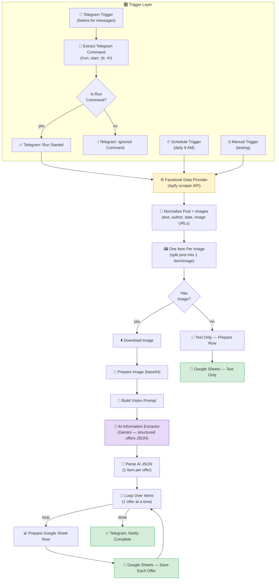

# fb-telecom-offer-scraper-n8n
Telegram-controlled n8n pipeline that scrapes Facebook group posts, uses Gemini AI to extract every individual telecom offer (GP/Robi/Airtel/Banglalink) as structured data, and logs it to Google Sheets automatically.
# 📲 Facebook Telecom Offer Scraper → AI Extractor → Google Sheets

**A Telegram-controlled n8n pipeline that scrapes telecom recharge offers from a Facebook group, uses Gemini AI to extract every individual offer as structured data, and logs it straight into Google Sheets.**

[](https://n8n.io)
[]()
[](https://core.telegram.org/bots)
[]()
[](LICENSE)

> Built and maintained by **[AI Smart Galaxy](#-author)** — n8n & Go High Level automation for freelance and agency clients.

---

## 📌 Overview

Telecom operators in Bangladesh (Grameenphone, Robi, Airtel, Banglalink) post dozens of recharge and data-pack offers in Facebook groups every day — as free-form text, images, or both, mixed together in a single post. Manually reading every post and copying offers into a spreadsheet is slow and error-prone, especially when a single post contains 20–50 distinct offers at once.

This workflow automates that entire process. It scrapes the latest post from a target Facebook group, splits it into text and image components, sends the content to **Google Gemini** through a LangChain **Information Extractor** node with a strict extraction schema, and writes every individual offer — operator, price, validity, data, minutes, SMS, recharge amount, and more — as its own row in Google Sheets. The whole thing can be triggered remotely from a **Telegram bot**, with the bot replying once the run starts and again when every offer has been logged.

**In one sentence:** *One Facebook post with 50 mixed offers in → 50 clean, structured spreadsheet rows out, triggered by a single Telegram message.*

---

## 🗺️ Workflow Diagram



**Reading the diagram:** the workflow can start three ways — a Telegram command, a daily schedule, or a manual test run — and all three converge on the same scraping logic. After scraping, every post is normalized and split so each image becomes its own item. Posts with images go through download → AI extraction → an offer-by-offer loop that appends one Google Sheets row per offer, one at a time, then notifies you on Telegram when finished. Posts without an image are logged as a single row in a separate sheet instead of being force-fit into the structured schema.

---

## ✨ Features

- **💬 Remote control via Telegram** — trigger a scraping run from anywhere by sending `/run`, `start`, `শুরু`, or `রান` to your bot; the bot confirms when the run starts and again when it's complete.
- **🕒 Flexible triggering** — supports Telegram command, a daily Schedule Trigger (8 AM), and a Manual Trigger for testing, all feeding the same pipeline.
- **🔍 Automated Facebook scraping** — pulls the latest post from a target Facebook group via the Apify Facebook Groups Scraper actor, no manual copy-pasting.
- **🧠 AI-powered offer extraction** — a Gemini-backed LangChain Information Extractor node reads the post and pulls out **every individual telecom offer**, even when a single post bundles 20–50 offers together, using a strict rule-based prompt that forbids merging or skipping offers.
- **📐 Structured, schema-enforced output** — every offer is normalized into consistent fields: operator, offer description, price, validity, data, minutes, SMS, recharge amount, app requirement, eligibility, USSD code, conditions, location, date, and other details.
- **🌐 Bengali-aware extraction** — the extraction prompt explicitly preserves Bengali text, Bengali numerals, and local units (মিনিট, টাকা, দিন, GB/MB) instead of flattening them into English.
- **🖼️ Dual-path handling for text vs. image posts** — posts with images go through the full AI extraction pipeline; text-only posts are logged directly to a separate sheet, avoiding wasted API calls on posts with nothing to extract visually.
- **🔁 Safe one-at-a-time logging** — offers are looped through and appended to Google Sheets individually rather than in one bulk write, reducing the chance of a partial or corrupted batch on failure.
- **📋 Two destination sheets** — structured multi-offer posts and text-only posts are logged to separate Google Sheets, keeping clean data separate from raw fallback text.

---

## 🛠️ Technologies Used

| Category | Technology |
|---|---|
| Orchestration | [n8n](https://n8n.io) (cloud or self-hosted) |
| Remote control | Telegram Bot API |
| Data source | [Apify](https://apify.com) Facebook Groups Scraper actor |
| AI extraction | Google Gemini via LangChain Information Extractor node (`@n8n/n8n-nodes-langchain`) |
| Data processing | n8n Code nodes (JavaScript) |
| Storage / output | Google Sheets API |
| Scheduling | n8n Schedule Trigger |

---

## 📁 Folder Structure

```
fb-telecom-offer-scraper/
├── README.md                        # You are here
├── LICENSE                          # MIT license
├── CONTRIBUTING.md                  # Contribution guidelines
├── .gitignore                       # Excludes credentials, exports, local env files
├── workflows/
│   └── fb-telecom-offer-scraper.json   # Importable n8n workflow export (API token redacted)
├── screenshots/
│   ├── n8n-workflow-canvas.png        # Full workflow canvas in n8n
│   ├── telegram-remote-control.png    # Live Telegram bot start/complete messages
│   └── google-sheet-output.png        # Structured offers logged in Google Sheets
└── docs/
    └── extraction-prompt.md           # The AI extraction rules/schema used by the Information Extractor
```

---

## 🚀 Setup Guide

### 1. Prerequisites

- An n8n instance (cloud or self-hosted) with the **LangChain (`@n8n/n8n-nodes-langchain`)** nodes enabled
- A Telegram bot token (create one via [@BotFather](https://t.me/BotFather)) and Telegram credentials configured in n8n
- An [Apify](https://apify.com) account with access to the `apify/facebook-groups-scraper` actor and an API token
- A Google Gemini API key
- Two Google Sheets: one for structured, multi-offer output, and one for text-only fallback posts, with Google Sheets OAuth2 credentials configured in n8n

### 2. Import the workflow

1. In n8n, go to **Workflows → Import from File**.
2. Select [`workflows/fb-telecom-offer-scraper.json`](workflows/fb-telecom-offer-scraper.json).
3. Reconnect all credentials (Telegram, Apify, Gemini, Google Sheets) before activating — the exported file has all live secrets removed.

### 3. Configure the Telegram bot

- Open **Telegram Trigger** and connect your bot's credentials.
- The **Code – Extract Telegram Command** node recognizes `/run`, `run`, `start`, `শুরু`, and `রান` (case-insensitive) as the signal to begin a scrape — edit the `runKeywords` array if you want different trigger words.

### 4. Configure the Facebook scraper

- Open **Facebook Data Provider** and replace the `Authorization` header value with your own Apify API token.
- Update the `startUrls` in the request body to point at your target Facebook group.
- `resultsLimit` is set to `1` (only the latest post) — increase it if you want to backfill older posts.

### 5. Configure Gemini extraction

- Open **Google Gemini Chat Model1** and connect your Gemini credentials.
- Review the extraction rules in **Information Extractor1** (also documented in [`docs/extraction-prompt.md`](docs/extraction-prompt.md)) and adjust the JSON schema if you want to track additional offer fields.

### 6. Configure Google Sheets

- Open **Google Sheets – Save Each Offer** and point it at your structured-offers spreadsheet (columns: `product`, `offer`, `price`, `validity`, `data`, `minitue`, `sms`, `recharge amount`).
- Open **Google Sheets – Text Only** and point it at your fallback spreadsheet for posts with no image.
- Connect your Google Sheets OAuth2 credentials on both nodes.

### 7. Activate and test

- Save and toggle the workflow **Active**.
- Message your Telegram bot with `/run` (or `start`, `শুরু`, `রান`) to trigger a live run, or use the **Manual Trigger** node for local testing.
- Watch the offers populate in your Google Sheet, and confirm the Telegram bot sends a completion message once every offer is logged.

> ⏱️ **Tip:** while testing extraction quality, run against a post with a known number of offers and confirm the row count in Google Sheets matches — this is the fastest way to catch merged or skipped offers.

---

## 💡 Use Cases

- **Telecom deal aggregators** — build a searchable, always up-to-date database of every GP/Robi/Airtel/Banglalink offer posted publicly, without manual data entry.
- **Comparison websites or bots** — feed the structured Google Sheet into a website, Telegram bot, or WhatsApp bot that lets users compare offers by price, data, or validity.
- **Market research** — track how often operators post promotions, average pricing trends, and validity periods over time using the logged data.
- **Reseller/agent tools** — give recharge shop owners or agents a live feed of current offers to quote customers accurately.
- **Any "extract structured data from noisy social posts" problem** — the same Facebook-scrape → AI-extract → Sheets pattern generalizes to price lists, event listings, job postings, or any domain with unstructured, high-volume social posts.

---

## 🖼️ Screenshots

| n8n Workflow Canvas | Telegram Remote Control | Structured Output in Google Sheets |
|---|---|---|
|  |  |  |

The Telegram screenshot shows a live run: sending `Start` triggers *"Data collection started..."*, and the bot follows up automatically with *"✅ Facebook data collection complete"* once every offer has been written to the sheet. The Google Sheets screenshot shows the resulting rows — each telecom offer (GP, Robi, Airtel, Banglalink) cleanly split into its own row with price, validity, data, and minutes in separate columns.

---

## 🩺 Troubleshooting

| Symptom | Likely Cause | Fix |
|---|---|---|
| Telegram bot doesn't respond to `/run` | Bot token/credentials not connected, or command not recognized | Confirm Telegram credentials are connected; check the `runKeywords` list matches what you're typing |
| Apify request fails or returns empty results | API token expired/invalid, or actor input misconfigured | Regenerate your Apify token and update the **Facebook Data Provider** header; verify the `startUrls` group URL is correct and public/accessible |
| Offers missing or merged incorrectly | AI extraction prompt not being followed strictly | Re-check the system prompt in `docs/extraction-prompt.md`; consider lowering Gemini's temperature or clarifying schema field descriptions |
| Some rows have empty fields | Source post genuinely didn't include that information | Expected behavior — the extractor is instructed to return `""` rather than guess; verify against the original post before assuming it's a bug |
| Text-only posts not appearing in the fallback sheet | `Has Image?` branch or **Google Sheets – Text Only** misconfigured | Confirm the IF node correctly evaluates `image_url` as empty, and that the fallback sheet's document ID is correct |
| Duplicate rows for the same post | Workflow triggered multiple times for the same post (e.g. schedule + manual test overlap) | Add a dedupe check against `post_id` before appending, similar to the pattern used in other scraper workflows in this portfolio |

---

## ✅ Best Practices

- **Never commit real API tokens or credentials** — the Apify token in this repo's workflow export has been replaced with a placeholder; always double-check exported JSON before pushing to a public repo.
- **Keep the extraction schema strict and explicit** — the more precisely each field is described in the system prompt, the less the model has to guess, which directly reduces merged/skipped offers.
- **Log text-only posts separately** — don't force posts with no image through the same structured schema; a dedicated fallback sheet keeps your primary dataset clean.
- **Rate-limit your Apify usage** — scraping runs cost Apify credits; a daily schedule or on-demand Telegram trigger is far more sustainable than aggressive polling.
- **Validate row counts after extraction** — spot-check that the number of Google Sheets rows matches the number of offers visible in the source post, especially for very long posts.
- **Version your workflow exports** in this repo every time you refine the extraction prompt or schema, so you can compare extraction quality across prompt versions.

---

## 🧭 Roadmap / Possible Extensions

- Add a `post_id`-based dedupe check before scraping/logging to prevent re-processing the same post on overlapping schedule and manual runs.
- Support multiple source Facebook groups in a single run instead of one hardcoded group URL.
- Add a lightweight dashboard (Google Looker Studio or a simple web app) on top of the Google Sheet for browsing and filtering offers.
- Extend the extraction schema to flag expired offers automatically based on the `validity` and `date` fields.

---

## 🤝 Contributing

Contributions, issue reports, and feature suggestions are welcome. Please see [CONTRIBUTING.md](CONTRIBUTING.md) for guidelines on submitting changes, reporting bugs, and proposing new features.

---

## 📄 License

This project is licensed under the [MIT License](LICENSE) — free to use, modify, and adapt for your own social-scraping-to-structured-data pipelines.

---

## 👤 Author

**AI Smart Galaxy**
Freelance Automation Specialist — n8n & Go High Level workflow automation

Building n8n and Go High Level workflow automations for freelance and agency clients on Fiverr and Upwork — from AI-powered data extraction pipelines and RAG voice agents to full-stack SaaS-style automation builds.

- 🌐 Portfolio: [aismartgalaxy.com](https://aismartgalaxy.com)


*If this project is useful to you or you'd like a custom scraping or data-extraction pipeline built for your business, feel free to get in touch.*
